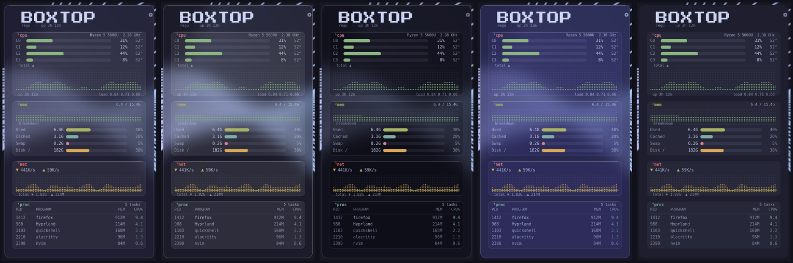
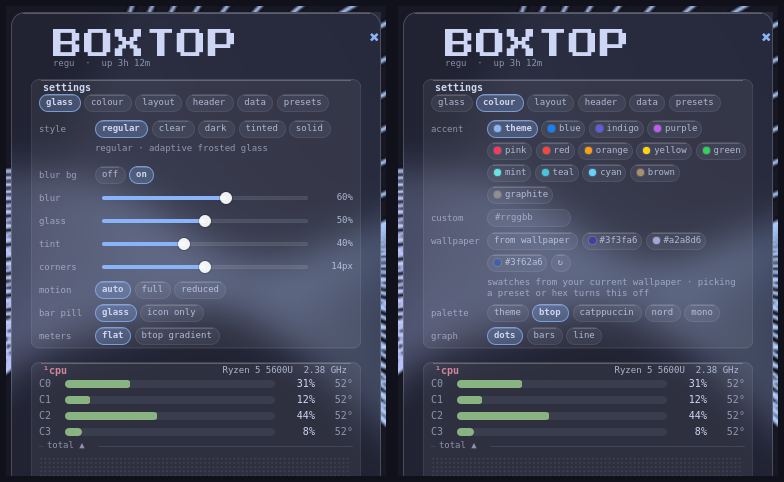

# Boxtop — btop-style system monitor for the Omarchy bar

A lightweight system monitor for the [Omarchy](https://omarchy.org) Quattro bar.
Click the chip icon to open a **liquid-glass** popup card inspired by
[btop](https://github.com/aristocratos/btop): CPU, memory, network and a live
process list in frosted glass boxes, with five glass styles, wallpaper-matched
accents and a built-in updater.

<p align="center">
  <picture>
    <source media="(prefers-color-scheme: light)" srcset="screenshots/panel-light.png">
    <source media="(prefers-color-scheme: dark)" srcset="screenshots/panel.png">
    
  </picture>
</p>

## Features

- **cpu** — per-core meters, temperature, frequency, CPU model, dot-matrix
  usage history, uptime and load average
- **mem** — RAM history graph plus Used / Cached / Swap / Disk meters
- **net** — live down / up rates (bytes or bits), totals and a peak-scaled chart
- **proc** — top processes by live CPU %, with PID and memory
- **Liquid glass** — translucent card, boxes, chips, sliders and bar pill with
  a 1 px hairline, a 1 px top highlight and rounded corners. Everything is flat:
  no gradients (the classic btop gradients are an opt-in setting)
- **Five glass styles** — Regular, Clear, Dark, Tinted, Solid (see below)
- **Readable on any wallpaper** — the text colour and glass opacity are solved
  so every label reaches at least **4.5:1** contrast (WCAG AA) against the glass
  over your theme background *and* your wallpaper's average colour
- **Accent colours** — 14 presets, any hex, or 3–5 swatches taken from your
  current Omarchy wallpaper
- **Live sliders** — blur, glass opacity, tint, corner radius, scale, title
  size, process count; dragging previews instantly and saves on release
- **Presets** — save, export, import and reset your whole look
- **Hero banner, photo and title fonts** — upload a banner and a profile photo,
  pick a bundled font (pixel / bebas / anton / mono), upload a TTF/OTF or use any
  installed font
- **Layout** — portrait or landscape, compact density, drag & drop box order,
  popup under the icon or centred
- **Built-in updater** — a small dot on the bar pill when a new version is out;
  one click updates in place, with backup and rollback
- **Very light** — one small sampler process runs only while the card is open
  (about 14 ms of CPU per tick on a Celeron N4020). When it's closed, nothing
  runs. Reads `/proc` and `/sys` directly; the only dependency is `python3`

## Glass styles



| Style | Setting | What it looks like |
| --- | --- | --- |
| **Regular** | `regular` | Adaptive frosted glass: theme-coloured, medium transparency |
| **Clear** | `clear` | High transparency; best with *blur behind* on |
| **Dark** | `dark` | Smoked glass: darker tint that calms busy wallpapers |
| **Tinted** | `tinted` | Glass coloured by your accent (or your wallpaper swatch) |
| **Solid** | `solid` | Opaque, no blur and no transparency — for accessibility or slow GPUs |

The style is applied consistently to the bar pill, the card, the boxes, the
chips and the sliders. If a style plus your wallpaper would make text too faint,
Boxtop raises the glass opacity just enough to keep 4.5:1 and says so in the
settings.

### Blur behind (Hyprland)

The frosted look comes from Hyprland blurring what is behind the card.
Turn it on in **⚙ → glass → blur bg → on**. Boxtop then writes an Omarchy
toggle file that Hyprland's config already loads:

```
~/.local/state/omarchy/toggles/hypr/boxtop-glass.lua
```

It enables `decoration.blur` (size and passes follow the **blur** slider, with
`popups = true`) and adds a layer rule that blurs the `omarchy-keyboard-panel`
namespace with `ignore_alpha = 0.05`, so only the card itself is blurred. Hyprland
is reloaded once, only when the file actually changes. Choosing **off** or the
**Solid** style deletes the file again. Note that `decoration.blur` is a global
Hyprland option: windows that Omarchy makes transparent are blurred too while
it is on.

## Install

```sh
omarchy plugin add https://github.com/Maftuuh1922/omarchy-boxtop.git --enable
```

Or install a release archive by hand:

```sh
curl -L https://github.com/Maftuuh1922/omarchy-boxtop/releases/latest/download/maftuuh.boxtop.tar.gz \
  | tar -xz -C ~/.config/omarchy/plugins/
omarchy plugin enable maftuuh.boxtop
```

Move it somewhere else on the bar if you like:

```sh
omarchy bar move maftuuh.boxtop --section right
```

Optional: `python3-pillow` (or ImageMagick) lets Boxtop read colours from your
wallpaper. Without either, the wallpaper swatches fall back to your theme colours.

## Update

Boxtop updates itself:

- It checks GitHub shortly after the shell starts and then every 6 hours.
  The answer is cached in `~/.cache/boxtop/update.json`, so opening the card
  doesn't hit the network again; offline checks fail quietly.
- When a newer version exists, a small accent dot appears on the bar pill and
  the card shows **Update available vX → vY** with the release notes.
- **update now** updates in place:
  - a git install (`omarchy plugin add`) is fast-forwarded to the new release
    tag (or `main`), validated, and reset to the old commit if anything fails
  - an archive install downloads the release tarball, validates it, backs up
    the current folder to `~/.cache/boxtop/backups/` (last two kept), swaps
    the new files in and restores the backup on any failure
  - you get a desktop notification either way, and the shell reloads after a
    successful update
- **later** hides the notice until the next version. Turn checks off with
  **⚙ → data → updates → off** (`updateCheck: false`).

What counts as "newer": the latest GitHub **release tag** compared with the
local `VERSION` file. If the repository has no releases, Boxtop compares the
`VERSION` file on `main`, and for git installs also offers new commits on
`main`.

From a terminal:

```sh
python3 ~/.config/omarchy/plugins/maftuuh.boxtop/updater.py check --force
python3 ~/.config/omarchy/plugins/maftuuh.boxtop/updater.py apply
# or the Omarchy way, for git installs:
omarchy plugin update maftuuh.boxtop
```

Your settings live outside the plugin folder (see below), so updates never
touch them.

## Usage

| Action | Result |
| --- | --- |
| Left click | Open / close the card |
| Middle click | Refresh now |
| `Esc` | Close the settings, or the card |
| ⚙ icon | Open / close the settings |
| **update now** | Shown when a newer version exists: updates in place |

From a terminal or keybinding:

```sh
omarchy-shell maftuuh.boxtop toggle
omarchy-shell maftuuh.boxtop glass dark          # regular | clear | dark | tinted | solid
omarchy-shell maftuuh.boxtop accent "#5e5ce6"    # preset name, hex, or wallpaper
omarchy-shell maftuuh.boxtop set blur 70
omarchy-shell maftuuh.boxtop savePreset "night"
omarchy-shell maftuuh.boxtop loadPreset "night"
omarchy-shell maftuuh.boxtop checkUpdate
omarchy-shell maftuuh.boxtop update
omarchy-shell maftuuh.boxtop reset               # back to defaults (keeps photo and banner)
```

## Customization

Click **⚙** in the card. Settings are grouped in tabs and apply live:



- **glass** — style, blur behind, blur / glass / tint / corner sliders, motion,
  bar pill, flat or btop-gradient meters
- **colour** — accent presets, custom hex, wallpaper swatches, box palette,
  graph style
- **layout** — portrait / landscape, popup position, scale, density, boxes and
  their order, text size, glass boxes or btop outlines, fade, shadow
- **header** — title, fonts, title and subtitle size, photo, hero banner
- **data** — refresh interval, process count, network and temperature units,
  update checks and version
- **presets** — save / export, import, delete, reset to defaults

### Where settings are stored

- Your widget entry in `~/.config/omarchy/shell.json` (the Omarchy convention,
  so `omarchy-shell maftuuh.boxtop set …` works)
- Mirrored to `~/.config/boxtop/settings.json`; a fresh install with no settings
  picks this file up automatically
- Presets: `~/.config/boxtop/presets/<name>.json` — plain JSON you can copy to
  another machine. Photo and banner paths are not exported
- Uploaded photo, banner and fonts: `~/.local/share/boxtop/`

### Config reference

| Setting | Values | Default | What it does |
| --- | --- | --- | --- |
| `glassStyle` | `regular`, `clear`, `dark`, `tinted`, `solid` | `regular` | Glass style for card, boxes, chips, sliders and bar pill |
| `hyprBlur` | `true`, `false` | `false` | Blur behind the card via a Hyprland toggle file (see above) |
| `blur` | `0` to `100` | `60` | Blur strength (Hyprland blur size 2–14, passes 1–4) |
| `glassOpacity` | `0` to `100` | `50` | Glass strength: higher is more opaque |
| `tint` | `0` to `100` | `40` | How much accent colour goes into the glass |
| `radius` | `0` to `28` (px) | `14` | Card corner radius; boxes and chips follow it |
| `scale` | `80` to `130` (%) | `100` | Scales the whole card |
| `motion` | `auto`, `on`, `off` | `auto` | Spring animations; `auto` follows Omarchy's animation toggle |
| `barPill` | `true`, `false` | `true` | Glass capsule behind the bar icon |
| `gradients` | `true`, `false` | `false` | Classic btop gradient meters, graphs and banner fade |
| `accent` | preset name or `#rrggbb` | `theme` | Accent: `theme`, `blue`, `indigo`, `purple`, `pink`, `red`, `orange`, `yellow`, `green`, `mint`, `teal`, `cyan`, `brown`, `graphite`, or any hex |
| `accentWallpaper` | `true`, `false` | `false` | Use a swatch from the current wallpaper as the accent |
| `accentWallpaperIndex` | `0` to `4` | `0` | Which wallpaper swatch |
| `preset` | `theme`, `btop`, `catppuccin`, `nord`, `mono` | `btop` | Box palette. `theme` follows your Omarchy theme |
| `graph` | `dots`, `bars`, `line` | `dots` | History graph style |
| `layout` | `portrait`, `landscape` | `portrait` | Card orientation |
| `popupPos` | `icon`, `center` | `icon` | Card under the bar icon or centred on the bar |
| `boxes` | any of `cpu`, `mem`, `net`, `proc` | all | Which boxes are shown |
| `order` | list of box names | `cpu, mem, net, proc` | Box order (also drag & drop the box titles) |
| `compact` | `true`, `false` | `false` | Tighter rows and graphs |
| `textSize` | `normal`, `small`, `tiny` | `normal` | Scale box text down |
| `stroke` | `true`, `false` | `false` | btop outlines instead of glass boxes |
| `lineWidth` | `1`, `2`, `3` | `1` | Outline thickness (with `stroke`) |
| `fade` | `true`, `false` | `true` | Process rows dim toward the bottom (never below the contrast floor) |
| `shadow` | `true`, `false` | `false` | Soft drop shadow behind text and lines |
| `title` | any text (up to 32 chars) | `BOXTOP` | Title next to the photo |
| `titleFont` | `pixel`, `bebas`, `anton`, `mono`, uploaded or system font | `pixel` | Title font |
| `titleSize` | `16` to `46` | `30` | Title text size |
| `subSize` | `7` to `13` | `9` | Size of the user@host · uptime line |
| `titleAlign` | `left`, `right` | `left` | Photo left or right of the title |
| `avatar` | `auto`, `none`, image path | `auto` | Profile photo |
| `hero` | `none`, image path | `none` | Hero banner (⚙ → header → upload banner…) |
| `heroPos`, `avatarPos` | `tl` … `br` (9 anchors) | `c` | Which part of the banner / photo stays visible |
| `interval` | `1` to `10` (seconds) | `2` | Refresh interval while the card is open |
| `procCount` | `3` to `15` | `8` | Number of processes |
| `netUnits` | `bytes`, `bits` | `bytes` | K/s or Kb/s |
| `tempUnit` | `c`, `f` | `c` | Temperature unit |
| `updateCheck` | `true`, `false` | `true` | Check GitHub for updates |

Example `shell.json` entry:

```json
{
  "id": "maftuuh.boxtop",
  "glassStyle": "tinted",
  "accentWallpaper": true,
  "hyprBlur": true,
  "blur": 70,
  "radius": 18,
  "graph": "line",
  "boxes": ["cpu", "mem", "proc"]
}
```

Upgrading from 1.4: your settings carry over. Boxes now default to glass
boxes — set `stroke: true` for the btop outlines, and `gradients: true` for the
old gradient meters and banner fade. `rounded: false` still gives sharp corners.

## Files

- `manifest.json` — plugin manifest
- `VERSION` — the installed version, used by the updater
- `Panel.qml` — bar pill, popup card, glass styling and settings
- `boxtop.py` — metrics sampler. `boxtop.py --watch INTERVAL COUNT` streams one
  JSON line per tick and keeps the previous sample in memory for CPU deltas;
  `boxtop.py [COUNT]` prints a single sample
- `boxtopctl.py` — one-shot helper for wallpaper swatches, the Hyprland blur
  toggle file, the settings mirror and presets (run on user actions only)
- `updater.py` — update check and in-place update with backup and rollback
- `fonts/` — bundled title fonts (Press Start 2P, Bebas Neue, Anton) with their
  OFL licences
- `tests/` — `python3 -m unittest discover -s tests` (no Qt or network needed)

## Uninstall

```sh
omarchy plugin remove maftuuh.boxtop
rm -f ~/.local/state/omarchy/toggles/hypr/boxtop-glass.lua && hyprctl reload   # if you used blur behind
rm -rf ~/.config/boxtop ~/.cache/boxtop ~/.local/share/boxtop                  # optional: settings, presets, uploads
```

## License

MIT
