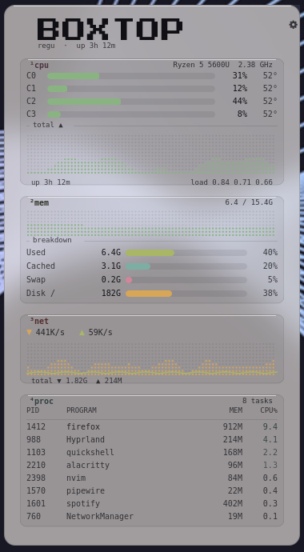
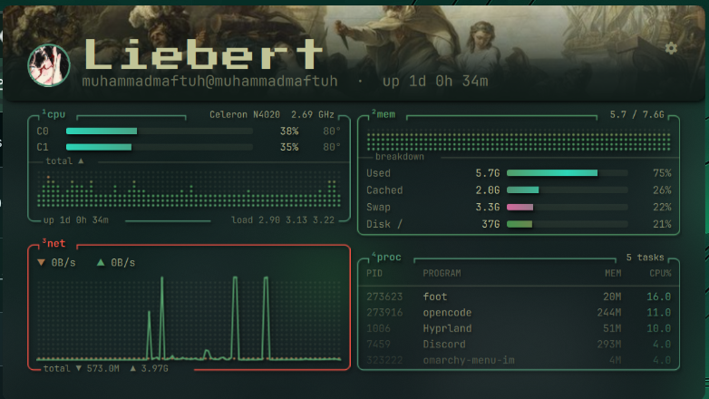
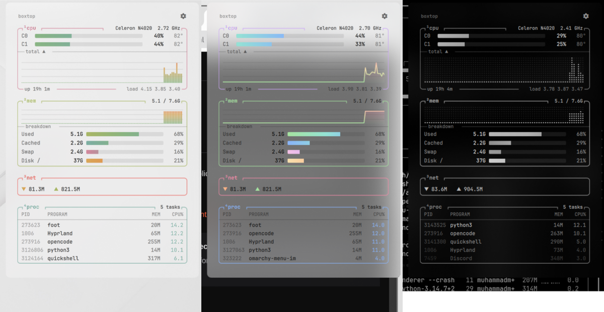
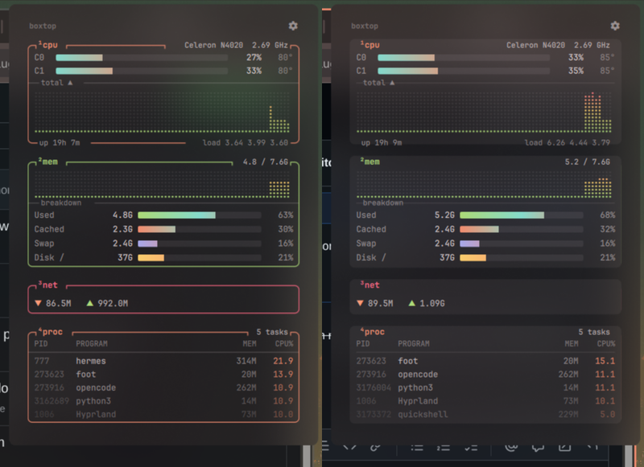

# Boxtop — btop-style system monitor for the Omarchy bar

A lightweight system monitor for the [Omarchy](https://omarchy.org) Quattro bar.
Click the chip icon to open a popup card styled after
[btop](https://github.com/aristocratos/btop): rounded boxes with tab titles,
dot-matrix history graphs, gradient meters and a live process list.

<p align="center">
  <picture>
    <source media="(prefers-color-scheme: light)" srcset="screenshots/panel-light.png">
    <source media="(prefers-color-scheme: dark)" srcset="screenshots/panel.png">
    
  </picture>
</p>

## Light & dark

Boxtop picks up text and background colours from your active Omarchy theme, so
it works with both light and dark themes.

| Dark (Lupine) | Light (Rose Pine) |
| :---: | :---: |
|  |  |


## Features

- **cpu** — per-core gradient meters, temperature, frequency, CPU model,
  dot-matrix usage history, uptime and load average
- **mem** — RAM history graph plus Used / Cached / Swap / Disk meters
- **net** — live up / down rates, totals and a peak-scaled traffic chart
- **proc** — top 8 processes by live CPU %, with PID and memory
- **hero banner** — upload a custom image; it runs full-bleed across the card
  with the title, photo and ⚙ sitting on top, then drains colour toward the
  bottom so it melts into the card
- **title** — custom text with bundled fonts (pixel / bebas / anton / mono),
  your own TTF/OTF upload, or any installed system font. The title size
  (16–46 px) only changes the text — the banner and photo keep their size
- **layout** — portrait or landscape card, compact density, and drag & drop
  the box titles to reorder the boxes
- **update notice** — when a newer release lands on GitHub, the card says so
  and updates itself in place
- Very light on resources: one small sampler process runs only while the card
  is open (about 1.5% of one core on a Celeron N4020). When it's closed,
  nothing runs.
- Reads `/proc` and `/sys` directly. No extra packages needed beyond `python3`.

## Hero banner

<p align="center"></p>

Open the settings (**⚙**) and use **hero → upload banner…** to pick an
image, then **hero pos** to choose which part of it stays visible. The card
header sits directly on the banner, and the banner's colour drains toward the
bottom so it merges into the card instead of ending in a hard edge.

## Install

```sh
omarchy plugin add https://github.com/Maftuuh1922/omarchy-boxtop.git --enable
```

Or install a release archive by hand:

```sh
curl -L https://github.com/Maftuuh1922/omarchy-boxtop/releases/latest/download/maftuuh.boxtop.tar.gz \
  | tar -xz -C ~/.config/omarchy/plugins/
omarchy plugin enable maftuuh.boxtop
```

Move it somewhere else on the bar if you like:

```sh
omarchy bar move maftuuh.boxtop --section right
```

## Usage

| Action | Result |
| --- | --- |
| Left click | Open / close the card |
| Middle click | Refresh now |
| `Esc` | Close the settings, or the card |
| ⚙ icon | Open / close the settings |
| **update** chip | Shown when the repo has a newer release: updates in place |

From a terminal or keybinding:

```sh
omarchy-shell maftuuh.boxtop toggle
```

## Customization

Click the **⚙** icon in the top-right corner of the card to change everything
live. Your choices are saved to your widget entry in
`~/.config/omarchy/shell.json`, so they survive plugin updates.



Left: `stroke` (btop outlines). Right: `no stroke` (soft filled boxes).



| Setting | Values | Default | What it does |
| --- | --- | --- | --- |
| `title` | any text (up to 32 chars) | `BOXTOP` | Title next to the photo |
| `titleFont` | `pixel`, `bebas`, `anton`, `mono`, uploaded or system font | `pixel` | Title font family |
| `titleSize` | `16` to `46` | `30` | Title text size only — banner and photo stay the same |
| `subSize` | `7` to `13` | `9` | Size of the user@host · uptime line |
| `textSize` | `normal`, `small`, `tiny` | `normal` | Scale all box text down |
| `titleAlign` | `left`, `right` | `left` | Photo on the left or the right of the title |
| `layout` | `portrait`, `landscape` | `portrait` | Card orientation |
| `hero` | image path | `none` | Hero banner (⚙ → hero → upload banner…) |
| `heroPos` | `tl` … `br` (9 anchors) | `c` | Which part of the banner stays visible |
| `avatarPos` | `tl` … `br` (9 anchors) | `c` | Which part of the photo stays visible |
| `preset` | `theme`, `btop`, `catppuccin`, `nord`, `mono` | `btop` | Colour palette. `theme` follows your active Omarchy theme and updates when you switch themes. |
| `graph` | `dots`, `bars`, `line` | `dots` | History graph style |
| `boxes` | any of `cpu`, `mem`, `net`, `proc` | all | Which boxes are shown |
| `compact` | `true`, `false` | `false` | Smaller card with tighter rows and graphs |
| `rounded` | `true`, `false` | `true` | Rounded or sharp box corners |
| `stroke` | `true`, `false` | `true` | Draw btop-style box outlines, or use soft filled boxes with no outline |
| `lineWidth` | `1`, `2`, `3` | `1` | Box border thickness |
| `fade` | `true`, `false` | `true` | btop-style fade: process rows get dimmer toward the bottom |
| `shadow` | `true`, `false` | `false` | Soft drop shadow behind text and lines |
| `interval` | `1` to `10` (seconds) | `2` | How often data is refreshed while the card is open |
| `procCount` | `3` to `15` | `8` | Number of processes in the list |

You can also edit them by hand:

```json
{
  "id": "maftuuh.boxtop",
  "preset": "catppuccin",
  "graph": "line",
  "boxes": ["cpu", "mem", "proc"],
  "compact": true,
  "fade": true,
  "shadow": false
}
```

Or from a terminal or keybinding:

```sh
omarchy-shell maftuuh.boxtop preset nord
omarchy-shell maftuuh.boxtop graph bars
omarchy-shell maftuuh.boxtop set shadow true
omarchy-shell maftuuh.boxtop set boxes '["cpu","mem"]'
```

## Optional: blurred card

The frosted look in the screenshots comes from Hyprland blur plus a translucent
popup background. Add this to `~/.config/hypr/looknfeel.lua`:

```lua
hl.config({ decoration = { blur = { enabled = true, size = 8, passes = 3, popups = true } } })
hl.layer_rule({ match = { namespace = "omarchy-keyboard-panel" }, blur = true, ignore_alpha = 0.1 })
```

and this to `~/.config/omarchy/shell.toml`:

```toml
[popups]
background-alpha = 0.40
```

## Files

- `manifest.json` — plugin manifest
- `Panel.qml` — bar button and popup card
- `boxtop.py` — metrics sampler. `boxtop.py --watch INTERVAL COUNT` streams
  one JSON line per tick and keeps the previous sample in memory for CPU
  deltas; `boxtop.py [COUNT]` prints a single sample.
- `fonts/` — bundled title fonts (Press Start 2P, Bebas Neue, Anton) with
  their OFL licences
- `update_check.py` — compares the local manifest with the one on GitHub and
  prints the newer version, so the card can offer a one-click update

## Uninstall

```sh
omarchy plugin remove maftuuh.boxtop
```

## License

MIT
