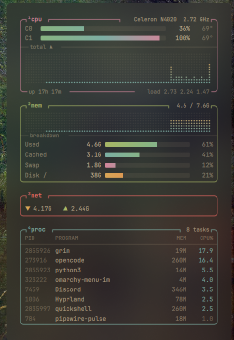
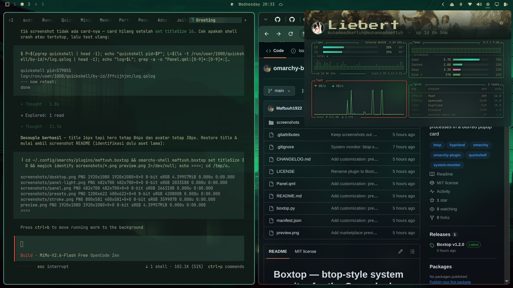

# Boxtop — btop-style system monitor for the Omarchy bar

A lightweight system monitor for the [Omarchy](https://omarchy.org) Quattro bar.
Click the chip icon to open a popup card styled after
[btop](https://github.com/aristocratos/btop): rounded boxes with tab titles,
dot-matrix history graphs, gradient meters and a live process list.





## Features

- **cpu** — per-core gradient meters, temperature, frequency, CPU model,
  dot-matrix usage history, uptime and load average
- **mem** — RAM history graph plus Used / Cached / Swap / Disk meters
- **net** — total bytes received and sent
- **proc** — top 8 processes by live CPU %, with PID and memory
- Very light on resources: data is only sampled (every 2 s) while the card is
  open. When it's closed, nothing runs.
- Reads `/proc` and `/sys` directly. No extra packages needed beyond `python3`.

## Install

```sh
omarchy plugin add https://github.com/Maftuuh1922/omarchy-boxtop.git --enable
```

Or install a release archive by hand:

```sh
curl -L https://github.com/Maftuuh1922/omarchy-boxtop/releases/latest/download/maftuuh.boxtop.tar.gz \
  | tar -xz -C ~/.config/omarchy/plugins/
omarchy plugin enable maftuuh.boxtop
```

Move it somewhere else on the bar if you like:

```sh
omarchy bar move maftuuh.boxtop --section right
```

## Usage

| Action | Result |
| --- | --- |
| Left click | Open / close the card |
| Middle click | Refresh now |
| `Esc` | Close the card |

From a terminal or keybinding:

```sh
omarchy-shell maftuuh.boxtop toggle
```

## Optional: blurred card

The frosted look in the screenshots comes from Hyprland blur plus a translucent
popup background. Add this to `~/.config/hypr/looknfeel.lua`:

```lua
hl.config({ decoration = { blur = { enabled = true, size = 8, passes = 3, popups = true } } })
hl.layer_rule({ match = { namespace = "omarchy-keyboard-panel" }, blur = true, ignore_alpha = 0.1 })
```

and this to `~/.config/omarchy/shell.toml`:

```toml
[popups]
background-alpha = 0.40
```

## Files

- `manifest.json` — plugin manifest
- `Panel.qml` — bar button and popup card
- `boxtop.py` — stateless metrics collector. It prints one JSON object and
  keeps a small CPU tick cache in `$XDG_RUNTIME_DIR` to work out per-process
  CPU %.

## Uninstall

```sh
omarchy plugin remove maftuuh.boxtop
```

## License

MIT
